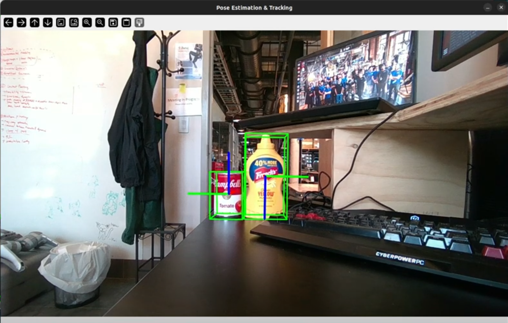
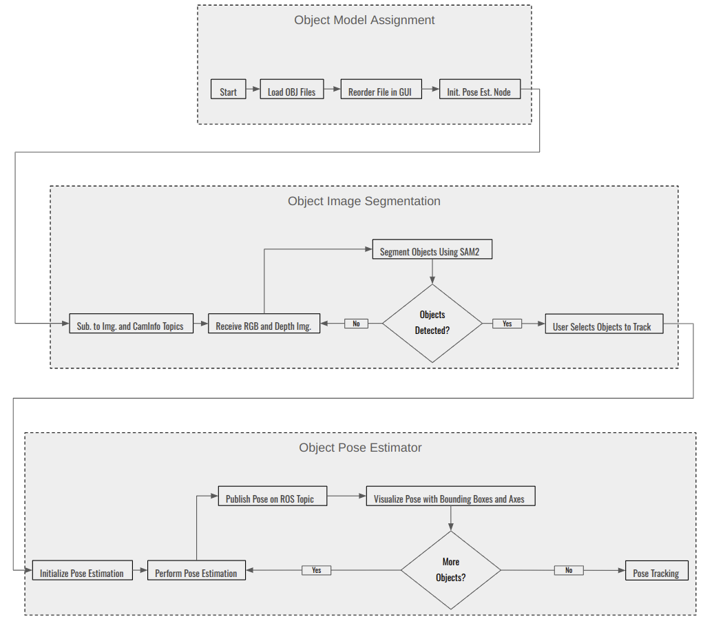

# FoundationPose: Rigid Object Pose Estimation and Tracking

<p align="center">
  <a href="https://www.youtube.com/watch?v=GuoGIRqMPj0" target="_blank">
    
  </a>
</p>

## Pipeline

<p align="center">
    
</p>

## Prerequisites
This repository is tested on Ubuntu 22.04, ROS2 humble, Cuda 12.1, Python 3.10 and Realsense Camera.

## Installation
### Docker Installation
You should install docker in your system before running the following commands.
#### Build the Image
Build the docker image with the following command:
```
./build_foundationpose_ros2_image.sh
```
Installation directories:
```
/root/ihmc_ros2_ws # The IHMC ROS2 interfaces get built and installed to here; source this to use IHMC ROS2 interfaces
/root/foundationpose-ros2/FoundationPose # The FoundationPose library; cloned from https://github.com/NVlabs/FoundationPose
/root/foundationpose-ros2 # This directory ([...]/ihmc-perception/src/foundationpose-ros2) mounted into the volume
```
#### Run a docker container
Run a docker container from a prebuilt docker image:
```
./run_foundationpose_node_docker.sh
```

#### Run with a Realsense
Run Realsense ros2 node system wide:
```
ros2 launch realsense2_camera rs_launch.py enable_rgbd:=true enable_sync:=true align_depth.enable:=true enable_color:=true enable_depth:=true pointcloud.enable:=true
```
Run inside the docker container:
```
python3 foundationpose_ros_multi.py
```
#### Run with a ZED2
With a ZED2 camera connected, run 
```
ZEDColorStereoDepthPublisher
``` 
Then run:
```
./run_zed2_centerpose_node_docker.sh
```
The ROS2 node will publish the poses detected from FoundationPose.

### Generic Installation
#### Install Dependencies 
Install realsense libraries following this [tutorial](https://github.com/ArghyaChatterjee/Realsense-Tutorial).

Then install realsense ros2 libraries from their binaries in the following way:
```bash
# Install ROS2 on Ubuntu
sudo apt install ros-humble-desktop

# Install librealsense2
sudo apt install ros-humble-librealsense2*

# Install debian realsense2 package
sudo apt install ros-humble-realsense2-*

# Install Miniconda
mkdir -p ~/miniconda3
wget https://repo.anaconda.com/miniconda/Miniconda3-latest-Linux-x86_64.sh -O ~/miniconda3/miniconda.sh
bash ~/miniconda3/miniconda.sh -b -u -p ~/miniconda3
rm ~/miniconda3/miniconda.sh
source ~/miniconda3/bin/activate
```

#### Clone the repo:

```bash
# Clone repository
git clone https://github.com/ihmcrobotics/ihmc-object-pose-estimation-pipeline.git
cd ihmc-object-pose-estimation-pipeline/rigid_object_pose_estimation/object_pose_estimation/FoundationPose/FoundationPoseROS2
```
#### Setup Conda Env:
```bash
# Create conda environment
conda create -n foundationpose-ros2 python=3.10 -y

# Activate conda environment
conda activate foundationpose-ros2
```
In the `setup.py` file located at `/FoundationPose/bundlesdf/mycuda/`, the C++ flags should be updated from **C++14** to **C++17** for compatibility with newer Nvidia GPUs. Change the values 

From:
```bash

nvcc_flags = ['-Xcompiler', '-O3', '-std=c++14', '-U__CUDA_NO_HALF_OPERATORS__', '-U__CUDA_NO_HALF_CONVERSIONS__', '-U__CUDA_NO_HALF2_OPERATORS__']
c_flags = ['-O3', '-std=c++14']
```
To:
```bash

nvcc_flags = ['-Xcompiler', '-O3', '-std=c++17', '-U__CUDA_NO_HALF_OPERATORS__', '-U__CUDA_NO_HALF_CONVERSIONS__', '-U__CUDA_NO_HALF2_OPERATORS__']
c_flags = ['-O3', '-std=c++17']
```
> [!NOTE]
> Conda environment must be created with the correct Python version according to the ROS2 distribution to ensure compatibility. For example, use Python 3.10 for ROS Humble.

```bash
# Build extensions
cd foundationpose-ros2
bash build_all_conda.sh
```
You need to force the Conda environment to use the system’s GCC runtime (where ROS 2 was built) by setting the following environment variable:
```bash
export LD_PRELOAD=/usr/lib/x86_64-linux-gnu/libstdc++.so.6
```
## Online Demo with Realsense
In a terminal, run realsense node:
```bash
source /opt/ros/humble/setup.bash 
ros2 launch realsense2_camera rs_launch.py enable_rgbd:=true enable_sync:=true align_depth.enable:=true enable_color:=true enable_depth:=true pointcloud.enable:=true
```


In a separate terminal, run foundationpose_ros_multi node:
```bash
conda activate foundationpose-ros2 
source /opt/ros/humble/setup.bash 
python3 foundationpose-ros2/foundationpose_ros_multi.py
```


## Offline Demo with ROSbag


First, download the recorded rosbag from this [link](). Once you've downloaded the rosbag file, navigate to the directory where it's located, and play it back with the following command:

```bash
# Play the downloaded rosbag
source /opt/ros/humble/setup.bash 
ros2 bag play <path_to_rosbag_file>/<demo-rosbag.db3>
```

Replace `<path_to_your_rosbag_file>` with the path to the `.db3` file you downloaded.

In a separate terminal, activate your conda environment, export the correct CUDA version path and run the foundationpose-ros2 script to start object pose estimation and tracking:

```bash
# Activate the conda environment and run foundationpose_ros_multi
conda activate foundationpose-ros2 
source /opt/ros/humble/setup.bash
python3 foundationpose-ros2/foundationpose_ros_multi.py
```

## Run on novel objects

Add the mesh file in .obj or .stl format to the folder:
```bash
"./foundationpose-ros2/demo_data/object_name/<OBJECT_MESH>.obj"
```

```bash
# Run
conda activate foundationpose-ros2  
source /opt/ros/humble/setup.bash  
python3 foundationpose-ros2/foundationpose_ros_multi.py
```

### Inputs:

- **Meshes:**
   - `.obj` / `.stl` mesh files from `demo_data/` directory (selected and ordered via a Tkinter GUI).
   - Used to match segmented objects in the scene.

- **Sensor Topics:**
   - `/camera/camera/color/image_raw` (type: `sensor_msgs/Image`)
   - `/camera/camera/aligned_depth_to_color/image_raw` (type: `sensor_msgs/Image`)
   - `/camera/camera/color/camera_info` (type: `sensor_msgs/CameraInfo`)

- **Segmentation:**
   - Uses `SAM2` (Segment Anything Model) to segment RGB frames for mask extraction.

- **User Interaction:**
   - GUI interface lets user manually associate segmented objects with the mesh files using click selection and keyboard control (`Enter`, `s`, `r`, etc.).

---

### Processing Logic:

- **First frame:**
  - Runs SAM2 on the RGB image to generate object masks.
  - User clicks on the segmented regions to associate them with meshes.
  - Each selected object gets initialized with `FoundationPose`, with model vertices, normals, and optional symmetry.
  
- **Subsequent frames:**
  - Uses `FoundationPose.track_one()` to track pose of selected objects.
  - Publishes updated poses.

---

### **Outputs:**

- **ROS Topics:**
   - Publishes `geometry_msgs/PoseStamped` messages for each tracked object:
     ```
     /Current_OBJ_position_1
     /Current_OBJ_position_2
     ...
     ```
   - Poses are transformed from **camera frame to base frame** using `cam_2_base_transform.py`.

- **Visual Feedback:**
   - `cv2.imshow()` displays:
     - SAM mask selection overlays.
     - 3D bounding boxes and axes drawn on RGB image (via `visualize_pose()`).

---

## Input/Output Summary
| **Stage**              | **Component**                      | **Purpose**                                      |
|------------------------|------------------------------------|--------------------------------------------------|
| Input RGB/D            | Camera topics                      | Real-time perception                             |
| 3D Models              | `demo_data/*.obj`                  | Object model for pose estimation                 |
| Segmentation           | SAM2                               | Extract objects from RGB                         |
| Matching & Selection   | GUI (Tkinter + OpenCV mouse input) | Map segmented masks to 3D models manually        |
| Pose Estimation        | `FoundationPose.register()`        | Register pose from RGB-D + mask + model          |
| Pose Tracking          | `FoundationPose.track_one()`       | Track object over time using DNN + render-compare|
| Pose Output            | ROS publisher                      | Publishes PoseStamped (in base frame)            |


## Features

- **Object Selection GUI**: Choose and reorder object files (.obj, .stl) using a simple Tkinter GUI.
- **Segmentation and Tracking**: SAM2 is used for object segmentation in real-time colour and depth images from a camera.
- **Pose Estimation**: Calculates and publishes the pose of detected objects based on camera images.
- **3D Visualization**: Visualize the objects’ pose with bounding boxes and axes.


